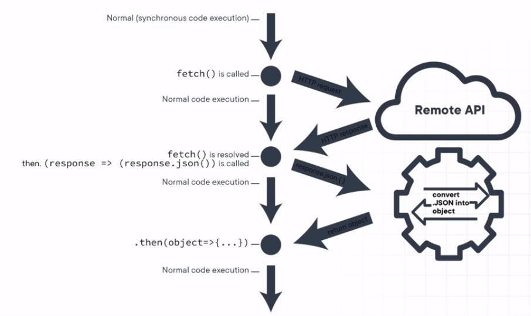

# 🎯 How JavaScript and Browser works? 
## | 1 | What is Internet?

## | 2 | What is IP address?

## | 3 | IPv4 vs IPv6 :

## | 4 | What is DNS?

## | 5 | What is Http?
Link -  https://developer.mozilla.org/en-US/docs/Web/HTTP/Overview 
>Answer : The Hypertext Transfer Protocol is an application layer protocol in the Internet protocol suite model for distributed, collaborative, hypermedia information systems.

## | 6 | HTTP Layer :
Video Link : https://www.youtube.com/watch?v=fiMswfo45DQ

## | 7 | What is Https?
>Answer : Hypertext Transfer Protocol Secure is an extension of the Hypertext Transfer Protocol. It is used for secure communication over a computer network, and is widely used on the Internet. In HTTPS, the communication protocol is encrypted using Transport Layer Security or, formerly, Secure Sockets Layer.
## | 8 | HTTP vs HTTPS :

## | 9 | What is SSL Certificate ?
Link-1 : https://www.tutorialsteacher.com/https/what-is-ssl-certificate  
Link-2 : https://www.cloudflare.com/learning/ssl/what-is-an-ssl-certificate/ 
## | 10 | DOM Tree :

## | 11 | Style Structure :

## | 12 | Rander Tree :

Paint Means Output.
## | 13 | Paint :

## | 14 | How Browser Works Overall?

## | 15 | What is V8 ?
>Answer : V8 is Google’s open source high-performance JavaScript and WebAssembly engine, written in C++. It is used in Chrome and in Node.js, among others. It implements ECMAScript and WebAssembly, and runs on Windows 7 or later, macOS 10.12+, and Linux systems that use x64, IA-32, ARM, or MIPS processors. V8 can run standalone, or can be embedded into any C++ application.  
>Link - https://v8.dev/  
WORK FLOW :
 
## | 16 | What is single-threaded?
Javascript is a single-threaded and synchronous language.
>A single-thread language is one with a single call stack and a single memory heap. It means that it runs only one thing at a time. A stack is a continuous region of memory, allocating local context for each executed function. A heap is a much larger region, storing everything allocated dynamically.
## | 17 | How to make Asynchronous Javascript ?

## | 18 | What do you mean by Synchronous ?

## | 19 | What do you mean by Asynchronous ?

## | 20 | Synchronous VS Asynchronous :

## | 21 | Promise :

## | 22 | Promise Structure :

## | 23 | Fetch API :

### How works:

# 🎯 JS Time Events :
## | 24 | setTimeOut() and clearTimeout() :

## | 25 | setInterval() and clearInterval() :

## | 26 | setTimeout() vs setInterval() :

## | 27 | Prefix vs Postfix (++i vs i++) :
